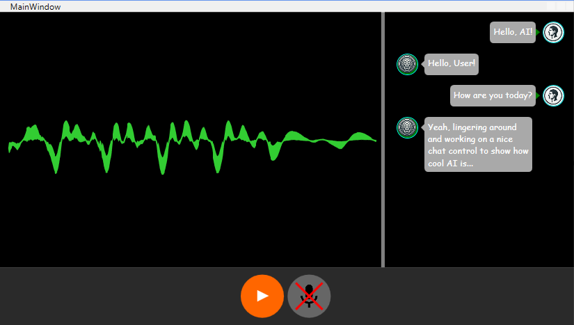

# Navbot.RealtimeApi.Dotnet.SDK


## Youtube playlist

https://www.youtube.com/playlist?list=PLtan4ax5Sz-1ckWzZWx872rFFuAukihNE

## Project Introduction

The Dotnet.SDK of OpenAI Real-Time API. We implemented serveral components that can directly interact with OpenAI Real-Time API, so that the .net developers can simply focus on the real-time conversation logic.

## Table of Contents

- [Feature Overview](#feature-overview)
- [Installation and Configuration](#installation-and-configuration)
- [Usage](#usage)
- [Feature Demonstration](#feature-demonstration)
- [License](#license)

## Feature Overview

The Realtime control provides the following key features:

- Real-time Speech Recognition: Converts user speech into text in real time, supporting continuous speech input and feedback.
- Text-to-Speech: Converts AI or other text information into speech and plays it.
- Multi-language Support: Supports speech recognition in multiple languages.
- OpenAI Integration: Integrates the OpenAI API, supporting intelligent conversation and natural language processing.
- Custom Features: Allows developers to customize API calls and speech-related functionalities.

## Installation and Configuration

### System Requirements

List the basic environment requirements needed to run the project:

- Operating System: Windows 10 or higher
- .NET Version: .NET 6.0 or higher
- Other Dependencies: OpenAI API key, NAudio, etc.

### NuGet Package Installation

To use the Realtime control, you need to install the following NuGet packages:

```bash
Navbot.RealtimeApi.Dotnet.SDK.Core
Navbot.RealtimeApi.Dotnet.SDK.WinForm
Navbot.RealtimeApi.Dotnet.SDK.WPF
```

You can install these packages by running the following commands in the **NuGet Package Manager Console**:

```bash
Install-Package Navbot.RealtimeApi.Dotnet.SDK.Core
Install-Package Navbot.RealtimeApi.Dotnet.SDK.WinForm
Install-Package Navbot.RealtimeApi.Dotnet.SDK.WPF
```

Alternatively, you can add them via the **Package Manager UI** by searching for each package.

### Feature Demonstration

1. **Speech Recognition**: Click the "Start" button to begin listening to the user's speech and convert it into text in real time.
2. **Speech Text**: By hooking up `RealtimeApiDesktopControl.PlaybackTextAvailable` event, the output text information of the AI speech will be displayed.
3. 

# **Navbot.RealtimeApi.Dotnet.SDK.Core**

> **Your voice conversation assistant**
> A powerful and flexible SDK for building real-time voice assistants with .NET.

------

## **Overview**

`Navbot.RealtimeApi.Dotnet.SDK.Core` is a powerful .NET SDK designed to simplify the development of real-time voice assistants. This SDK allows you to quickly integrate features such as voice input/output, session management, and audio waveform rendering, making it suitable for both desktop applications and cloud services.

------

## **Features**

- **Real-time voice processing**: Quickly capture and process user audio input.
- **Audio waveform rendering**: Supports custom audio waveform rendering.
- **Flexible configuration**: Customize audio visualization with various styles and colors.
- **Multi-framework support**: Compatible with .NET 6, and .NET 8.
- **Easy integration**: Simple API with highly extensible interface design.

------

## **Installation**

### Install via NuGet

Run the following command in the NuGet Package Manager:

```shell
Install-Package Navbot.RealtimeApi.Dotnet.SDK.Core
```

Or add the following to your project file (`.csproj`):

```xml
<PackageReference Include="Navbot.RealtimeApi.Dotnet.SDK.Core" Version="1.0.1" />
```

------

## **Supported Features**

| Feature                      | Description                                                  |
| ---------------------------- | ------------------------------------------------------------ |
| Real-time waveform rendering | Capture audio and render high-quality waveforms in real-time. |
| Diverse style support        | Offers multiple waveform styles, including standard and SoundCloud-inspired styles. |
| Extensible interface design  | Adapts to different audio processing needs, making it easy to extend. |

------

## **Contribution Guidelines**

We welcome developer contributions! Please follow these steps:

1. Fork this repository.
2. Develop new features or fix bugs in your branch: `git checkout -b feature/your-feature-name`.
3. Commit your changes: `git commit -m "Add your feature"`.
4. Push the branch: `git push origin feature/your-feature-name`.
5. Submit a Pull Request.

Please ensure that all unit tests pass before submitting your code.

------

## **Contact Us**

If you have any questions or suggestions, feel free to contact us:

- **Email**: fuwei007@gmail.com
- **GitHub Issues**: [GitHub Repository](https://github.com/fuwei007/OpenAI-realtimeapi-dotnetsdk/issues)


## **Navbot.RealtimeApi.Dotnet.SDK.WinForm**

### **Step 1: Import the Core and WinForms SDK**

```c#
using Navbot.RealtimeApi.Dotnet.SDK.Core;
using Navbot.RealtimeApi.Dotnet.SDK.WinForm;
```

### **Step 2: Add the RealtimeApiWinFormControl Control**

Drag and drop the `realtimeApiWinFormControl` onto your form or add it programmatically:

```c#
var realtimeApiWinFormControl = new RealtimeApiWinFormControl();
this.Controls.Add(realtimeApiWinFormControl);
```

### **Step 3: Get OPENAI_API_KEY**

```c#
private void MainFrom_Load(object sender, EventArgs e)
{
    string openAiApiKey = Environment.GetEnvironmentVariable("OPENAI_API_KEY") ?? "";
    realtimeApiDesktopControl.OpenAiApiKey = openAiApiKey;
}
```


### **Step 4: Start Processing Audio**

```c#
realtimeApiDesktopControl.StartSpeechRecognition()
```

### **Step 5: End Processing Audio**

```c#
realtimeApiDesktopControl.StopSpeechRecognition();
```


## **Navbot.RealtimeApi.Dotnet.SDK.WPF**

### **Step 1: Import the Core and WPF SDK**

```c#
using Navbot.RealtimeApi.Dotnet.SDK.Core;
using Navbot.RealtimeApi.Dotnet.SDK.WPF;
```

### Step 2: Use RealtimeApiWpfControl in XAML

```xml
<Window x:Class="YourNamespace.MainWindow"
        xmlns="http://schemas.microsoft.com/winfx/2006/xaml/presentation"
        xmlns:x="http://schemas.microsoft.com/winfx/2006/xaml"
        xmlns:wpf="clr-namespace:Navbot.RealtimeApi.Dotnet.SDK.WPF"
        Title="MainWindow" Height="450" Width="800">
    <Grid>
        <wpf:RealtimeApiWpfControl x:Name="realtimeApiWpfControl" />
    </Grid>
</Window>

```

### Step 3: Get OPENAI_API_KEY

```c#
private void Window_Loaded(object sender, RoutedEventArgs e)
{
    string openAiApiKey = Environment.GetEnvironmentVariable("OPENAI_API_KEY") ?? "";
    realtimeApiWpfControl.OpenAiApiKey = openAiApiKey;
}
```

### **Step 4: Start Processing Audio**

```c#
realtimeApiWpfControl.StartSpeechRecognition();
```

### **Step 5: End Processing Audio**

```c#
realtimeApiWpfControl.StopSpeechRecognition();
```

## License

This project is licensed under the [MIT](LICENSE) License.